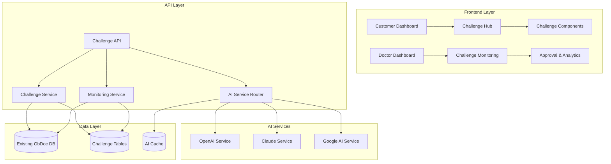
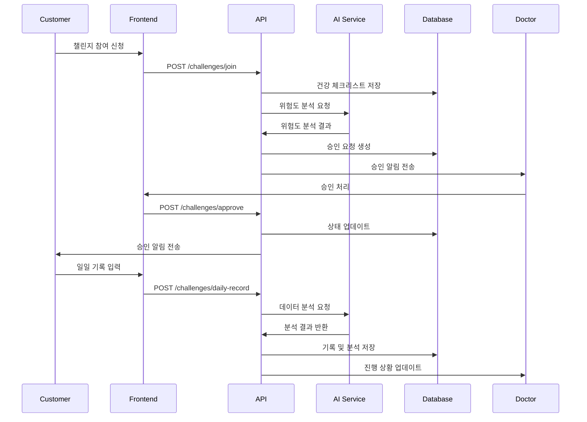

# 챌린지 시스템 설계 문서

## 개요

ObDoc 챌린지 시스템은 기존 커뮤니티 기능을 확장하여 의사-고객 간의 지속적인 건강 관리를 강화하는 시스템입니다. 하이브리드 AI 분석을 통한 개인화된 건강 피드백과 실시간 모니터링을 제공하며, 기존 시스템과의 완벽한 호환성을 유지합니다.

## 아키텍처

### 시스템 아키텍처 다이어그램



### 데이터베이스 설계

#### 새로 추가되는 테이블

```sql
-- 챌린지 정의 테이블
CREATE TABLE challenges (
  id UUID DEFAULT uuid_generate_v4() PRIMARY KEY,
  name TEXT NOT NULL,
  type TEXT NOT NULL CHECK (type IN ('water_intake', 'colorful_diet', 'dii_analysis', 'intermittent_fasting')),
  description TEXT NOT NULL,
  duration_days INTEGER NOT NULL DEFAULT 30,
  requires_doctor_approval BOOLEAN DEFAULT false,
  difficulty_level TEXT CHECK (difficulty_level IN ('easy', 'medium', 'hard')),
  target_metrics JSONB DEFAULT '{}',
  is_active BOOLEAN DEFAULT true,
  created_at TIMESTAMP WITH TIME ZONE DEFAULT NOW(),
  updated_at TIMESTAMP WITH TIME ZONE DEFAULT NOW()
);

-- 고객-챌린지 참여 테이블
CREATE TABLE customer_challenges (
  id UUID DEFAULT uuid_generate_v4() PRIMARY KEY,
  customer_id UUID REFERENCES customers(id) ON DELETE CASCADE,
  challenge_id UUID REFERENCES challenges(id) ON DELETE CASCADE,
  doctor_id UUID REFERENCES doctors(id) ON DELETE CASCADE,
  status TEXT DEFAULT 'pending' CHECK (status IN ('pending', 'approved', 'active', 'completed', 'cancelled', 'failed')),
  start_date DATE,
  end_date DATE,
  target_value DECIMAL(10,2),
  current_progress DECIMAL(10,2) DEFAULT 0,
  completion_rate DECIMAL(5,2) DEFAULT 0,
  health_checklist JSONB DEFAULT '{}',
  doctor_notes TEXT,
  approved_at TIMESTAMP WITH TIME ZONE,
  completed_at TIMESTAMP WITH TIME ZONE,
  created_at TIMESTAMP WITH TIME ZONE DEFAULT NOW(),
  updated_at TIMESTAMP WITH TIME ZONE DEFAULT NOW(),
  UNIQUE(customer_id, challenge_id)
);

-- 일일 챌린지 기록 테이블
CREATE TABLE challenge_daily_records (
  id UUID DEFAULT uuid_generate_v4() PRIMARY KEY,
  customer_challenge_id UUID REFERENCES customer_challenges(id) ON DELETE CASCADE,
  record_date DATE NOT NULL,
  record_type TEXT NOT NULL CHECK (record_type IN ('water_intake', 'food_log', 'color_checklist', 'fasting_status')),
  record_data JSONB NOT NULL DEFAULT '{}',
  ai_analysis JSONB DEFAULT '{}',
  progress_value DECIMAL(10,2),
  notes TEXT,
  created_at TIMESTAMP WITH TIME ZONE DEFAULT NOW(),
  UNIQUE(customer_challenge_id, record_date, record_type)
);

-- AI 분석 로그 테이블
CREATE TABLE ai_analysis_logs (
  id UUID DEFAULT uuid_generate_v4() PRIMARY KEY,
  customer_id UUID REFERENCES customers(id) ON DELETE CASCADE,
  provider TEXT NOT NULL CHECK (provider IN ('openai', 'claude', 'google')),
  analysis_type TEXT NOT NULL CHECK (analysis_type IN ('food_recognition', 'dii_calculation', 'health_assessment', 'risk_detection')),
  input_data JSONB NOT NULL,
  output_data JSONB NOT NULL,
  processing_time_ms INTEGER,
  cost_usd DECIMAL(10,6),
  success BOOLEAN DEFAULT true,
  error_message TEXT,
  created_at TIMESTAMP WITH TIME ZONE DEFAULT NOW()
);

-- 챌린지 알림 테이블
CREATE TABLE challenge_notifications (
  id UUID DEFAULT uuid_generate_v4() PRIMARY KEY,
  recipient_id UUID REFERENCES users(id) ON DELETE CASCADE,
  recipient_type TEXT NOT NULL CHECK (recipient_type IN ('customer', 'doctor')),
  notification_type TEXT NOT NULL CHECK (notification_type IN ('approval_request', 'risk_alert', 'progress_update', 'completion', 'reminder')),
  title TEXT NOT NULL,
  message TEXT NOT NULL,
  related_challenge_id UUID REFERENCES customer_challenges(id) ON DELETE CASCADE,
  is_read BOOLEAN DEFAULT false,
  priority TEXT DEFAULT 'normal' CHECK (priority IN ('low', 'normal', 'high', 'urgent')),
  created_at TIMESTAMP WITH TIME ZONE DEFAULT NOW()
);
```

#### 인덱스 추가

```sql
-- 성능 최적화를 위한 인덱스
CREATE INDEX idx_customer_challenges_customer_id ON customer_challenges(customer_id);
CREATE INDEX idx_customer_challenges_doctor_id ON customer_challenges(doctor_id);
CREATE INDEX idx_customer_challenges_status ON customer_challenges(status);
CREATE INDEX idx_challenge_daily_records_customer_challenge_id ON challenge_daily_records(customer_challenge_id);
CREATE INDEX idx_challenge_daily_records_date ON challenge_daily_records(record_date);
CREATE INDEX idx_ai_analysis_logs_customer_id ON ai_analysis_logs(customer_id);
CREATE INDEX idx_ai_analysis_logs_provider ON ai_analysis_logs(provider);
CREATE INDEX idx_challenge_notifications_recipient ON challenge_notifications(recipient_id, is_read);
```

## 컴포넌트 및 인터페이스

### 프론트엔드 컴포넌트 구조

```
src/components/challenges/
├── ChallengeHub.tsx              # 메인 챌린지 허브
├── ChallengeCard.tsx             # 개별 챌린지 카드
├── ChallengeDetail.tsx           # 챌린지 상세 정보
├── ChallengeJoinModal.tsx        # 챌린지 참여 모달
├── HealthChecklistForm.tsx       # 건강 체크리스트
├── daily-records/
│   ├── WaterIntakeRecord.tsx     # 물 섭취 기록
│   ├── FoodLogRecord.tsx         # 식사 기록
│   ├── ColorChecklistRecord.tsx  # 컬러풀 체크리스트
│   └── FastingStatusRecord.tsx   # 단식 상태 기록
├── monitoring/
│   ├── ChallengeProgressChart.tsx # 진행률 차트
│   ├── AIFeedbackPanel.tsx       # AI 피드백 패널
│   └── RiskAlertBanner.tsx       # 위험 알림 배너
└── doctor/
    ├── ChallengeApprovalList.tsx # 승인 대기 목록
    ├── CustomerChallengeMonitor.tsx # 고객 모니터링
    └── ChallengeAnalyticsDashboard.tsx # 분석 대시보드
```

### API 엔드포인트 설계

```typescript
// 챌린지 관련 API
interface ChallengeAPI {
  // 고객용 API
  getAvailableChallenges(): Promise<Challenge[]>
  joinChallenge(challengeId: string, healthChecklist: HealthChecklist): Promise<CustomerChallenge>
  getMyActiveChallenges(): Promise<CustomerChallenge[]>
  submitDailyRecord(challengeId: string, record: DailyRecord): Promise<DailyRecordResponse>
  getChallengeProgress(challengeId: string): Promise<ChallengeProgress>
  
  // 의사용 API
  getPendingApprovals(): Promise<CustomerChallenge[]>
  approveChallenge(challengeId: string, notes?: string): Promise<void>
  rejectChallenge(challengeId: string, reason: string): Promise<void>
  getCustomerChallenges(customerId: string): Promise<CustomerChallenge[]>
  getChallengeAnalytics(): Promise<ChallengeAnalytics>
  
  // AI 분석 API
  analyzeFood(foodText: string): Promise<FoodAnalysis>
  calculateDII(foods: Food[]): Promise<DIIAnalysis>
  assessHealthRisk(customerData: CustomerHealthData): Promise<RiskAssessment>
}
```

### 타입 정의

```typescript
// 챌린지 관련 타입
export interface Challenge {
  id: string
  name: string
  type: ChallengeType
  description: string
  durationDays: number
  requiresDoctorApproval: boolean
  difficultyLevel: 'easy' | 'medium' | 'hard'
  targetMetrics: Record<string, any>
  isActive: boolean
}

export type ChallengeType = 'water_intake' | 'colorful_diet' | 'dii_analysis' | 'intermittent_fasting'

export interface CustomerChallenge {
  id: string
  customerId: string
  challengeId: string
  doctorId: string
  status: ChallengeStatus
  startDate: string
  endDate: string
  targetValue: number
  currentProgress: number
  completionRate: number
  healthChecklist: HealthChecklist
  doctorNotes?: string
}

export type ChallengeStatus = 'pending' | 'approved' | 'active' | 'completed' | 'cancelled' | 'failed'

export interface DailyRecord {
  recordDate: string
  recordType: RecordType
  recordData: Record<string, any>
  aiAnalysis?: AIAnalysis
  progressValue: number
  notes?: string
}

export type RecordType = 'water_intake' | 'food_log' | 'color_checklist' | 'fasting_status'

export interface AIAnalysis {
  provider: 'openai' | 'claude' | 'google'
  analysisType: string
  result: Record<string, any>
  confidence: number
  processingTime: number
  cost: number
}

export interface HealthChecklist {
  age: number
  weight: number
  height: number
  medicalConditions: string[]
  medications: string[]
  allergies: string[]
  exerciseLevel: 'low' | 'medium' | 'high'
  dietaryRestrictions: string[]
  previousChallengeExperience: boolean
}
```

## 데이터 모델

### 챌린지 데이터 플로우



### AI 서비스 통합

```typescript
// 하이브리드 AI 서비스 아키텍처
class HybridAIService {
  private providers: {
    openai: OpenAIService
    claude: ClaudeService
    google: GoogleAIService
  }
  
  private router: AIRouter
  private cache: AICache
  private costTracker: CostTracker
  
  async analyzeFood(text: string, customerId: string): Promise<FoodAnalysis> {
    // 1. 캐시 확인
    const cacheKey = `food_analysis:${hash(text)}`
    const cached = await this.cache.get(cacheKey)
    if (cached) return cached
    
    // 2. 최적 AI 모델 선택
    const provider = await this.router.selectOptimalProvider('food_analysis', {
      language: 'korean',
      complexity: this.assessComplexity(text),
      costBudget: await this.costTracker.getRemainingBudget()
    })
    
    // 3. AI 분석 실행 (fallback 포함)
    const result = await this.executeWithFallback(provider, text, customerId)
    
    // 4. 결과 캐싱 및 비용 추적
    await this.cache.set(cacheKey, result, 3600)
    await this.costTracker.recordUsage(provider, result.cost)
    
    return result
  }
  
  private async executeWithFallback(
    primaryProvider: string, 
    data: any, 
    customerId: string
  ): Promise<any> {
    try {
      return await this.providers[primaryProvider].analyze(data)
    } catch (error) {
      console.warn(`Primary AI (${primaryProvider}) failed, trying fallback`)
      const fallbackProvider = this.router.getFallbackProvider(primaryProvider)
      return await this.providers[fallbackProvider].analyze(data)
    }
  }
}
```

## 에러 처리

### 에러 처리 전략

```typescript
// 챌린지 시스템 에러 처리
export class ChallengeError extends Error {
  constructor(
    public code: string,
    public message: string,
    public statusCode: number = 400,
    public details?: any
  ) {
    super(message)
    this.name = 'ChallengeError'
  }
}

export const ChallengeErrorCodes = {
  CHALLENGE_NOT_FOUND: 'CHALLENGE_NOT_FOUND',
  ALREADY_PARTICIPATING: 'ALREADY_PARTICIPATING',
  DOCTOR_APPROVAL_REQUIRED: 'DOCTOR_APPROVAL_REQUIRED',
  HEALTH_RISK_DETECTED: 'HEALTH_RISK_DETECTED',
  AI_SERVICE_UNAVAILABLE: 'AI_SERVICE_UNAVAILABLE',
  DAILY_RECORD_ALREADY_EXISTS: 'DAILY_RECORD_ALREADY_EXISTS',
  INVALID_RECORD_DATA: 'INVALID_RECORD_DATA'
} as const

// 에러 처리 미들웨어
export const challengeErrorHandler = (error: Error, req: Request, res: Response, next: NextFunction) => {
  if (error instanceof ChallengeError) {
    return res.status(error.statusCode).json({
      error: {
        code: error.code,
        message: error.message,
        details: error.details
      }
    })
  }
  
  // AI 서비스 에러 처리
  if (error.message.includes('AI_SERVICE')) {
    return res.status(503).json({
      error: {
        code: 'AI_SERVICE_UNAVAILABLE',
        message: 'AI 분석 서비스가 일시적으로 사용할 수 없습니다. 잠시 후 다시 시도해주세요.',
        fallbackAvailable: true
      }
    })
  }
  
  next(error)
}
```

### 복구 및 재시도 로직

```typescript
// AI 서비스 복구 전략
export class AIServiceRecovery {
  private maxRetries = 3
  private retryDelay = 1000
  
  async executeWithRetry<T>(
    operation: () => Promise<T>,
    context: string
  ): Promise<T> {
    let lastError: Error
    
    for (let attempt = 1; attempt <= this.maxRetries; attempt++) {
      try {
        return await operation()
      } catch (error) {
        lastError = error
        
        if (attempt === this.maxRetries) {
          await this.logFailure(context, error)
          throw error
        }
        
        await this.delay(this.retryDelay * attempt)
      }
    }
    
    throw lastError!
  }
  
  private async delay(ms: number): Promise<void> {
    return new Promise(resolve => setTimeout(resolve, ms))
  }
  
  private async logFailure(context: string, error: Error): Promise<void> {
    console.error(`AI Service failure in ${context}:`, error)
    // 모니터링 시스템에 알림 전송
    await this.sendAlert({
      type: 'ai_service_failure',
      context,
      error: error.message,
      timestamp: new Date().toISOString()
    })
  }
}
```

## 테스트 전략

### 테스트 계층

```typescript
// 단위 테스트 예시
describe('ChallengeService', () => {
  describe('joinChallenge', () => {
    it('should create pending challenge for high-risk challenge types', async () => {
      const challengeService = new ChallengeService()
      const result = await challengeService.joinChallenge({
        customerId: 'customer-1',
        challengeId: 'intermittent-fasting',
        healthChecklist: mockHealthChecklist
      })
      
      expect(result.status).toBe('pending')
      expect(result.requiresDoctorApproval).toBe(true)
    })
    
    it('should auto-approve low-risk challenges', async () => {
      const challengeService = new ChallengeService()
      const result = await challengeService.joinChallenge({
        customerId: 'customer-1',
        challengeId: 'water-intake',
        healthChecklist: mockHealthChecklist
      })
      
      expect(result.status).toBe('approved')
    })
  })
})

// 통합 테스트 예시
describe('AI Analysis Integration', () => {
  it('should fallback to secondary AI when primary fails', async () => {
    const aiService = new HybridAIService()
    
    // Primary AI 실패 시뮬레이션
    jest.spyOn(aiService.providers.openai, 'analyze').mockRejectedValue(new Error('API Error'))
    
    const result = await aiService.analyzeFood('김치찌개 한 그릇', 'customer-1')
    
    expect(result.provider).toBe('claude') // fallback provider
    expect(result.analysis).toBeDefined()
  })
})
```

### 성능 테스트

```typescript
// 성능 테스트 시나리오
describe('Performance Tests', () => {
  it('should handle 100 concurrent daily record submissions', async () => {
    const promises = Array.from({ length: 100 }, (_, i) => 
      submitDailyRecord(`customer-${i}`, mockDailyRecord)
    )
    
    const startTime = Date.now()
    const results = await Promise.all(promises)
    const endTime = Date.now()
    
    expect(endTime - startTime).toBeLessThan(5000) // 5초 이내
    expect(results.every(r => r.success)).toBe(true)
  })
  
  it('should maintain AI response time under 3 seconds', async () => {
    const aiService = new HybridAIService()
    
    const startTime = Date.now()
    const result = await aiService.analyzeFood('복잡한 한식 메뉴 설명...', 'customer-1')
    const endTime = Date.now()
    
    expect(endTime - startTime).toBeLessThan(3000)
    expect(result.analysis).toBeDefined()
  })
})
```

이 설계 문서는 ObDoc 챌린지 시스템의 전체적인 아키텍처와 구현 방향을 제시합니다. 기존 시스템과의 호환성을 유지하면서도 확장 가능한 구조로 설계되었습니다.
