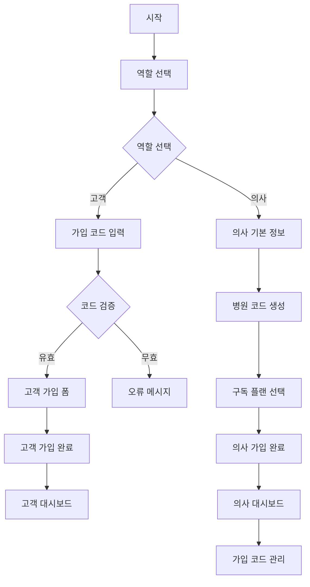

# Design Document

## Overview

의료 서비스의 특성을 고려하여 병원 코드 시스템과 고객 가입 코드 검증을 포함한 역할 기반 회원가입 시스템을 설계합니다. 의사/한의사는 고유한 병원 코드를 부여받고 2단계 가입 프로세스를 통해 구독 플랜을 선택하며, 일반 고객은 반드시 병원에서 제공받은 가입 코드를 통해서만 가입할 수 있어 의료 안전성을 확보합니다.

## Architecture

### 컴포넌트 구조

```
SignupForm (메인 컨테이너)
├── RoleSelectionStep (역할 선택)
├── CustomerSignupForm (고객 가입 폼)
│   └── InviteCodeValidator (가입 코드 검증)
├── DoctorSignupFlow (의사 가입 플로우)
│   ├── DoctorBasicInfoStep (1단계: 기본 정보)
│   ├── HospitalCodeGenerator (병원 코드 생성)
│   └── SubscriptionPlanStep (2단계: 구독 플랜 선택)
└── AdminHospitalManager (관리자 병원 관리)
    ├── HospitalCodeManager (병원 코드 관리)
    └── InviteCodeMonitor (가입 코드 모니터링)
```

### 상태 관리

```typescript
interface SignupState {
  currentStep: 'role-selection' | 'customer-form' | 'doctor-basic' | 'doctor-subscription'
  selectedRole: 'doctor' | 'customer' | null
  hospitalCode?: string
  inviteCode?: string
  formData: {
    basic: BasicFormData
    doctor: DoctorFormData
    subscription: SubscriptionData
    hospital: HospitalData
  }
  isSubmitting: boolean
  error: string | null
}
```

### 보안 플로우 다이어그램



## Components and Interfaces

### 1. RoleSelectionStep

**목적:** 사용자가 의사/한의사 또는 일반 고객 중 역할을 선택하는 첫 번째 단계

**Props:**
```typescript
interface RoleSelectionStepProps {
  onRoleSelect: (role: 'doctor' | 'customer') => void
  selectedRole: 'doctor' | 'customer' | null
}
```

**기능:**
- 시각적으로 구분되는 역할 선택 카드
- 각 역할에 대한 간단한 설명 제공
- 선택된 역할에 따른 시각적 피드백

### 2. CustomerSignupForm

**목적:** 일반 고객을 위한 간소화된 가입 폼

**Props:**
```typescript
interface CustomerSignupFormProps {
  onSubmit: (data: CustomerFormData) => Promise<void>
  onBack: () => void
  isSubmitting: boolean
  error: string | null
}
```

**포함 필드:**
- 이메일
- 비밀번호
- 비밀번호 확인
- 이름 (선택사항)
- 전화번호 (선택사항)

**특징:**
- 구독 플랜 정보 완전 숨김
- 간단하고 직관적인 UI
- 빠른 가입 완료

### 3. DoctorSignupFlow

**목적:** 의사/한의사를 위한 2단계 가입 플로우 관리

**Props:**
```typescript
interface DoctorSignupFlowProps {
  onComplete: (data: DoctorCompleteData) => Promise<void>
  onBack: () => void
  isSubmitting: boolean
  error: string | null
}
```

**상태 관리:**
- 현재 단계 추적
- 단계별 데이터 저장
- 진행 상황 표시

### 4. DoctorBasicInfoStep

**목적:** 의사의 기본 정보 및 병원 정보 입력

**포함 필드:**
- 이메일
- 비밀번호
- 비밀번호 확인
- 이름
- 전화번호
- 병원명
- 병원 유형 (의원/한의원/병원)
- 의료진 정보 (선택사항)

**검증:**
- 이메일 중복 확인
- 비밀번호 강도 검증
- 병원 정보 유효성 검사

### 5. SubscriptionPlanStep

**목적:** 구독 플랜 선택 및 결제 정보 확인

**포함 요소:**
- 플랜 비교 테이블
- 할인 정보 강조
- 선택된 플랜 요약
- 결제 예정 금액 표시

**플랜 정보:**
```typescript
interface SubscriptionPlan {
  id: '1month' | '6months' | '12months'
  name: string
  duration: string
  price: number
  originalPrice?: number
  discount?: number
  features: string[]
  recommended?: boolean
}
```

### 6. ProgressIndicator

**목적:** 다단계 가입 과정의 진행 상황 표시

**Props:**
```typescript
interface ProgressIndicatorProps {
  currentStep: number
  totalSteps: number
  stepLabels: string[]
}
```

## Data Models

### 기본 폼 데이터

```typescript
interface BasicFormData {
  email: string
  password: string
  confirmPassword: string
  name?: string
  phone?: string
}
```

### 고객 폼 데이터

```typescript
interface CustomerFormData extends BasicFormData {
  role: 'customer'
}
```

### 의사 폼 데이터

```typescript
interface DoctorFormData extends BasicFormData {
  role: 'doctor'
  hospitalName: string
  hospitalType: 'clinic' | 'oriental_clinic' | 'hospital'
  medicalLicense?: string
  specialization?: string
}
```

### 구독 데이터

```typescript
interface SubscriptionData {
  planId: '1month' | '6months' | '12months'
  planName: string
  price: number
  duration: string
  paymentMethod?: 'card' | 'bank_transfer'
}
```

### 완성된 가입 데이터

```typescript
interface DoctorCompleteData extends DoctorFormData {
  subscription: SubscriptionData
}
```

## Error Handling

### 에러 타입 정의

```typescript
interface SignupError {
  type: 'validation' | 'network' | 'server' | 'auth'
  field?: string
  message: string
  code?: string
}
```

### 에러 처리 전략

1. **필드별 검증 에러**
   - 실시간 검증으로 즉시 피드백
   - 필드 하단에 에러 메시지 표시
   - 에러가 있는 필드로 자동 포커스

2. **네트워크 에러**
   - 재시도 버튼 제공
   - 오프라인 상태 감지
   - 임시 저장 기능

3. **서버 에러**
   - 사용자 친화적 메시지 변환
   - 관리자 알림 발송
   - 에러 로그 수집

4. **인증 에러**
   - 이메일 중복 안내
   - 비밀번호 정책 안내
   - 계정 복구 옵션 제공

## Testing Strategy

### 단위 테스트

1. **컴포넌트 테스트**
   - 각 단계별 컴포넌트 렌더링 테스트
   - 사용자 입력 처리 테스트
   - 상태 변화 테스트

2. **폼 검증 테스트**
   - 필드별 검증 규칙 테스트
   - 에러 메시지 표시 테스트
   - 조건부 필드 표시 테스트

3. **데이터 처리 테스트**
   - 폼 데이터 변환 테스트
   - API 호출 테스트
   - 에러 처리 테스트

### 통합 테스트

1. **플로우 테스트**
   - 고객 가입 전체 플로우
   - 의사 가입 전체 플로우
   - 단계 간 이동 테스트

2. **API 통합 테스트**
   - 회원가입 API 호출
   - 의사 프로필 생성
   - 구독 정보 저장

### E2E 테스트

1. **사용자 시나리오**
   - 고객으로 가입하기
   - 의사로 가입하기
   - 가입 후 로그인 확인

2. **에러 시나리오**
   - 네트워크 오류 처리
   - 중복 이메일 처리
   - 결제 실패 처리

## Performance Considerations

### 코드 분할

```typescript
// 역할별 컴포넌트 지연 로딩
const CustomerSignupForm = lazy(() => import('./CustomerSignupForm'))
const DoctorSignupFlow = lazy(() => import('./DoctorSignupFlow'))
```

### 상태 최적화

- 불필요한 리렌더링 방지를 위한 React.memo 사용
- 폼 상태 최적화를 위한 useCallback 활용
- 단계별 데이터 캐싱

### 네트워크 최적화

- 이메일 중복 확인 디바운싱
- 구독 플랜 정보 캐싱
- 이미지 지연 로딩

## Security Considerations

### 클라이언트 사이드 보안

1. **입력 검증**
   - XSS 방지를 위한 입력 sanitization
   - SQL Injection 방지
   - 파일 업로드 검증

2. **민감 정보 처리**
   - 비밀번호 마스킹
   - 메모리에서 민감 정보 제거
   - HTTPS 강제 사용

### 서버 사이드 보안

1. **인증 및 인가**
   - JWT 토큰 검증
   - 역할 기반 접근 제어
   - 세션 관리

2. **데이터 보호**
   - 비밀번호 해싱
   - 개인정보 암호화
   - 감사 로그 기록

## Migration Strategy

### 기존 시스템과의 호환성

1. **점진적 마이그레이션**
   - 기존 SignupForm 유지하면서 새 컴포넌트 개발
   - Feature flag를 통한 단계적 배포
   - 사용자 피드백 수집 후 완전 전환

2. **데이터 마이그레이션**
   - 기존 사용자 데이터 호환성 유지
   - 새로운 필드 추가 시 기본값 설정
   - 롤백 계획 수립

3. **API 호환성**
   - 기존 auth.signUp 함수 유지
   - 새로운 역할별 가입 API 추가
   - 버전 관리를 통한 점진적 전환
### 1
. InviteCodeValidator

**목적:** 고객 가입 시 병원에서 제공받은 가입 코드 검증

**Props:**
```typescript
interface InviteCodeValidatorProps {
  onCodeValidated: (hospitalInfo: HospitalInfo) => void
  onValidationError: (error: string) => void
  isValidating: boolean
}
```

**기능:**
- 가입 코드 형식 검증
- 서버 측 코드 유효성 확인
- 만료 시간 검증
- 병원 정보 반환

### 2. HospitalCodeGenerator

**목적:** 의사 가입 시 고유한 병원 코드 자동 생성

**Props:**
```typescript
interface HospitalCodeGeneratorProps {
  hospitalName: string
  hospitalType: 'clinic' | 'oriental_clinic' | 'hospital'
  onCodeGenerated: (code: string) => void
}
```

**코드 생성 규칙:**
```typescript
// 병원 코드 형식: OB-{지역코드}-{타입}-{순번}
// 예시: OB-SEOUL-CLINIC-001, OB-BUSAN-HOSPITAL-015
const generateHospitalCode = (region: string, type: string): string => {
  const prefix = 'OB'
  const regionCode = getRegionCode(region)
  const typeCode = getTypeCode(type)
  const sequence = getNextSequence(regionCode, typeCode)
  return `${prefix}-${regionCode}-${typeCode}-${sequence.padStart(3, '0')}`
}
```

### 3. InviteCodeManager

**목적:** 의사가 고객 가입용 코드를 생성하고 관리

**Props:**
```typescript
interface InviteCodeManagerProps {
  hospitalCode: string
  onCodeGenerated: (code: InviteCode) => void
  onCodeRevoked: (codeId: string) => void
  existingCodes: InviteCode[]
}
```

**가입 코드 생성 규칙:**
```typescript
// 가입 코드 형식: {병원코드}-{년월}-{랜덤문자열}
// 예시: OB-SEOUL-CLINIC-001-2024-01-A7B9X2K5
const generateInviteCode = (hospitalCode: string): string => {
  const yearMonth = new Date().toISOString().slice(0, 7).replace('-', '')
  const randomString = generateSecureRandom(8)
  return `${hospitalCode}-${yearMonth}-${randomString}`
}
```

### 4. AdminHospitalManager

**목적:** 시스템 관리자의 병원 및 가입 코드 통합 관리

**기능:**
- 전체 병원 코드 목록 조회
- 병원별 가입 현황 통계
- 가입 코드 사용 현황 모니터링
- 의심스러운 활동 감지 및 알림

## Data Models

### 병원 정보

```typescript
interface HospitalData {
  hospitalCode: string // 고유 병원 코드
  hospitalName: string
  hospitalType: 'clinic' | 'oriental_clinic' | 'hospital'
  region: string
  address?: string
  phoneNumber?: string
  registrationNumber?: string // 사업자등록번호
  medicalLicenseNumber?: string // 의료기관 허가번호
  createdAt: Date
  isActive: boolean
}
```

### 가입 코드 정보

```typescript
interface InviteCode {
  id: string
  code: string // 암호화된 가입 코드
  hospitalCode: string
  createdBy: string // 생성한 의사 ID
  createdAt: Date
  expiresAt: Date
  maxUses?: number // 최대 사용 횟수
  currentUses: number // 현재 사용 횟수
  isActive: boolean
  usageHistory: InviteCodeUsage[]
}

interface InviteCodeUsage {
  id: string
  inviteCodeId: string
  customerId: string
  usedAt: Date
  ipAddress: string
  userAgent: string
}
```

### 확장된 고객 데이터

```typescript
interface CustomerFormData extends BasicFormData {
  role: 'customer'
  inviteCode: string
  hospitalCode: string // 소속 병원 코드
  invitedBy: string // 초대한 의사 ID
  joinedAt: Date
}
```

### 확장된 의사 데이터

```typescript
interface DoctorFormData extends BasicFormData {
  role: 'doctor'
  hospitalCode: string // 자동 생성된 병원 코드
  hospitalData: HospitalData
  medicalLicense: string
  specialization?: string
  yearsOfExperience?: number
}
```

## Security Considerations

### 코드 보안

1. **가입 코드 암호화**
   ```typescript
   // 가입 코드는 데이터베이스에 해시된 형태로 저장
   const hashInviteCode = (code: string): string => {
     return bcrypt.hashSync(code, 12)
   }
   
   // 검증 시에는 해시 비교
   const validateInviteCode = (inputCode: string, hashedCode: string): boolean => {
     return bcrypt.compareSync(inputCode, hashedCode)
   }
   ```

2. **병원 코드 중복 방지**
   ```typescript
   const ensureUniqueHospitalCode = async (code: string): Promise<string> => {
     const exists = await checkHospitalCodeExists(code)
     if (exists) {
       // 충돌 시 추가 문자열 생성
       return generateAlternativeCode(code)
     }
     return code
   }
   ```

3. **Rate Limiting**
   - 가입 코드 검증: 분당 5회 제한
   - 병원 코드 생성: 시간당 3회 제한
   - 가입 시도: 분당 3회 제한

### 데이터 보호

1. **개인정보 암호화**
   ```typescript
   const encryptSensitiveData = (data: string): string => {
     return CryptoJS.AES.encrypt(data, process.env.ENCRYPTION_KEY).toString()
   }
   ```

2. **감사 로그**
   ```typescript
   interface AuditLog {
     id: string
     action: 'signup' | 'code_generation' | 'code_usage' | 'admin_access'
     userId: string
     hospitalCode?: string
     ipAddress: string
     userAgent: string
     timestamp: Date
     details: Record<string, any>
   }
   ```

## API Design

### 가입 코드 관리 API

```typescript
// 가입 코드 생성
POST /api/invite-codes
{
  hospitalCode: string
  expiresIn: number // 시간(시)
  maxUses?: number
}

// 가입 코드 검증
POST /api/invite-codes/validate
{
  code: string
}

// 가입 코드 목록 조회
GET /api/invite-codes?hospitalCode={code}&status={active|expired|used}

// 가입 코드 비활성화
DELETE /api/invite-codes/{codeId}
```

### 병원 관리 API

```typescript
// 병원 코드 생성
POST /api/hospitals/generate-code
{
  hospitalName: string
  hospitalType: string
  region: string
}

// 병원 정보 조회
GET /api/hospitals/{hospitalCode}

// 병원 목록 조회 (관리자용)
GET /api/admin/hospitals?page={page}&limit={limit}

// 병원 통계 조회
GET /api/admin/hospitals/{hospitalCode}/stats
```

## Error Handling

### 가입 코드 관련 에러

```typescript
enum InviteCodeError {
  INVALID_FORMAT = 'INVITE_CODE_INVALID_FORMAT',
  NOT_FOUND = 'INVITE_CODE_NOT_FOUND',
  EXPIRED = 'INVITE_CODE_EXPIRED',
  MAX_USES_EXCEEDED = 'INVITE_CODE_MAX_USES_EXCEEDED',
  HOSPITAL_INACTIVE = 'INVITE_CODE_HOSPITAL_INACTIVE'
}
```

### 병원 코드 관련 에러

```typescript
enum HospitalCodeError {
  GENERATION_FAILED = 'HOSPITAL_CODE_GENERATION_FAILED',
  DUPLICATE_CODE = 'HOSPITAL_CODE_DUPLICATE',
  INVALID_HOSPITAL_INFO = 'HOSPITAL_CODE_INVALID_INFO',
  RATE_LIMIT_EXCEEDED = 'HOSPITAL_CODE_RATE_LIMIT'
}
```

## Testing Strategy

### 보안 테스트

1. **가입 코드 보안 테스트**
   - 무차별 대입 공격 방어 테스트
   - 코드 추측 공격 방어 테스트
   - 만료된 코드 사용 방지 테스트

2. **병원 코드 보안 테스트**
   - 코드 중복 방지 테스트
   - 무단 코드 생성 방지 테스트
   - 권한 없는 접근 차단 테스트

### 통합 테스트

1. **전체 가입 플로우 테스트**
   - 고객 가입 코드 검증 플로우
   - 의사 병원 코드 생성 플로우
   - 관리자 모니터링 플로우

2. **에러 시나리오 테스트**
   - 잘못된 가입 코드 처리
   - 만료된 코드 처리
   - 네트워크 오류 처리

## Performance Considerations

### 코드 검증 최적화

```typescript
// 가입 코드 검증 캐싱
const cacheValidatedCodes = new Map<string, {
  isValid: boolean
  hospitalInfo: HospitalInfo
  expiresAt: number
}>()

const validateInviteCodeWithCache = async (code: string): Promise<ValidationResult> => {
  const cached = cacheValidatedCodes.get(code)
  if (cached && cached.expiresAt > Date.now()) {
    return cached
  }
  
  const result = await validateInviteCodeFromDB(code)
  cacheValidatedCodes.set(code, {
    ...result,
    expiresAt: Date.now() + 5 * 60 * 1000 // 5분 캐시
  })
  
  return result
}
```

### 데이터베이스 최적화

```sql
-- 가입 코드 검색 최적화를 위한 인덱스
CREATE INDEX idx_invite_codes_code_active ON invite_codes(code, is_active);
CREATE INDEX idx_invite_codes_hospital_active ON invite_codes(hospital_code, is_active);
CREATE INDEX idx_invite_codes_expires_at ON invite_codes(expires_at);

-- 병원 코드 검색 최적화를 위한 인덱스
CREATE UNIQUE INDEX idx_hospitals_code ON hospitals(hospital_code);
CREATE INDEX idx_hospitals_region_type ON hospitals(region, hospital_type);
```

## Monitoring and Analytics

### 가입 현황 모니터링

```typescript
interface SignupMetrics {
  totalSignups: number
  doctorSignups: number
  customerSignups: number
  signupsByHospital: Record<string, number>
  inviteCodeUsageRate: number
  averageTimeToSignup: number
  failedSignupAttempts: number
}
```

### 보안 모니터링

```typescript
interface SecurityMetrics {
  suspiciousSignupAttempts: number
  invalidCodeAttempts: number
  rateLimitViolations: number
  unusualSignupPatterns: SecurityAlert[]
}

interface SecurityAlert {
  type: 'MULTIPLE_FAILED_CODES' | 'RAPID_SIGNUP_ATTEMPTS' | 'SUSPICIOUS_IP'
  severity: 'LOW' | 'MEDIUM' | 'HIGH'
  details: Record<string, any>
  timestamp: Date
}
```
