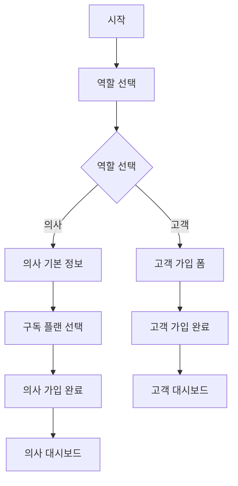

# Design Document

## Overview

현재 회원가입 시스템을 역할 기반 다단계 플로우로 개선하여 사용자 경험을 향상시키고, 각 사용자 그룹에게 적절한 정보만 제공하는 시스템을 설계합니다. 의사/한의사는 2단계 가입 프로세스를 통해 구독 플랜을 명확하게 선택하고, 일반 고객은 간소화된 가입 과정을 경험하게 됩니다.

## Architecture

### 컴포넌트 구조

```
SignupForm (메인 컨테이너)
├── RoleSelectionStep (역할 선택)
├── CustomerSignupForm (고객 가입 폼)
└── DoctorSignupFlow (의사 가입 플로우)
    ├── DoctorBasicInfoStep (1단계: 기본 정보)
    └── SubscriptionPlanStep (2단계: 구독 플랜 선택)
```

### 상태 관리

```typescript
interface SignupState {
  currentStep: 'role-selection' | 'customer-form' | 'doctor-basic' | 'doctor-subscription'
  selectedRole: 'doctor' | 'customer' | null
  formData: {
    basic: BasicFormData
    doctor: DoctorFormData
    subscription: SubscriptionData
  }
  isSubmitting: boolean
  error: string | null
}
```

### 플로우 다이어그램



## Components and Interfaces

### 1. RoleSelectionStep

**목적:** 사용자가 의사/한의사 또는 일반 고객 중 역할을 선택하는 첫 번째 단계

**Props:**
```typescript
interface RoleSelectionStepProps {
  onRoleSelect: (role: 'doctor' | 'customer') => void
  selectedRole: 'doctor' | 'customer' | null
}
```

**기능:**
- 시각적으로 구분되는 역할 선택 카드
- 각 역할에 대한 간단한 설명 제공
- 선택된 역할에 따른 시각적 피드백

### 2. CustomerSignupForm

**목적:** 일반 고객을 위한 간소화된 가입 폼

**Props:**
```typescript
interface CustomerSignupFormProps {
  onSubmit: (data: CustomerFormData) => Promise<void>
  onBack: () => void
  isSubmitting: boolean
  error: string | null
}
```

**포함 필드:**
- 이메일
- 비밀번호
- 비밀번호 확인
- 이름 (선택사항)
- 전화번호 (선택사항)

**특징:**
- 구독 플랜 정보 완전 숨김
- 간단하고 직관적인 UI
- 빠른 가입 완료

### 3. DoctorSignupFlow

**목적:** 의사/한의사를 위한 2단계 가입 플로우 관리

**Props:**
```typescript
interface DoctorSignupFlowProps {
  onComplete: (data: DoctorCompleteData) => Promise<void>
  onBack: () => void
  isSubmitting: boolean
  error: string | null
}
```

**상태 관리:**
- 현재 단계 추적
- 단계별 데이터 저장
- 진행 상황 표시

### 4. DoctorBasicInfoStep

**목적:** 의사의 기본 정보 및 병원 정보 입력

**포함 필드:**
- 이메일
- 비밀번호
- 비밀번호 확인
- 이름
- 전화번호
- 병원명
- 병원 유형 (의원/한의원/병원)
- 의료진 정보 (선택사항)

**검증:**
- 이메일 중복 확인
- 비밀번호 강도 검증
- 병원 정보 유효성 검사

### 5. SubscriptionPlanStep

**목적:** 구독 플랜 선택 및 결제 정보 확인

**포함 요소:**
- 플랜 비교 테이블
- 할인 정보 강조
- 선택된 플랜 요약
- 결제 예정 금액 표시

**플랜 정보:**
```typescript
interface SubscriptionPlan {
  id: '1month' | '6months' | '12months'
  name: string
  duration: string
  price: number
  originalPrice?: number
  discount?: number
  features: string[]
  recommended?: boolean
}
```

### 6. ProgressIndicator

**목적:** 다단계 가입 과정의 진행 상황 표시

**Props:**
```typescript
interface ProgressIndicatorProps {
  currentStep: number
  totalSteps: number
  stepLabels: string[]
}
```

## Data Models

### 기본 폼 데이터

```typescript
interface BasicFormData {
  email: string
  password: string
  confirmPassword: string
  name?: string
  phone?: string
}
```

### 고객 폼 데이터

```typescript
interface CustomerFormData extends BasicFormData {
  role: 'customer'
}
```

### 의사 폼 데이터

```typescript
interface DoctorFormData extends BasicFormData {
  role: 'doctor'
  hospitalName: string
  hospitalType: 'clinic' | 'oriental_clinic' | 'hospital'
  medicalLicense?: string
  specialization?: string
}
```

### 구독 데이터

```typescript
interface SubscriptionData {
  planId: '1month' | '6months' | '12months'
  planName: string
  price: number
  duration: string
  paymentMethod?: 'card' | 'bank_transfer'
}
```

### 완성된 가입 데이터

```typescript
interface DoctorCompleteData extends DoctorFormData {
  subscription: SubscriptionData
}
```

## Error Handling

### 에러 타입 정의

```typescript
interface SignupError {
  type: 'validation' | 'network' | 'server' | 'auth'
  field?: string
  message: string
  code?: string
}
```

### 에러 처리 전략

1. **필드별 검증 에러**
   - 실시간 검증으로 즉시 피드백
   - 필드 하단에 에러 메시지 표시
   - 에러가 있는 필드로 자동 포커스

2. **네트워크 에러**
   - 재시도 버튼 제공
   - 오프라인 상태 감지
   - 임시 저장 기능

3. **서버 에러**
   - 사용자 친화적 메시지 변환
   - 관리자 알림 발송
   - 에러 로그 수집

4. **인증 에러**
   - 이메일 중복 안내
   - 비밀번호 정책 안내
   - 계정 복구 옵션 제공

## Testing Strategy

### 단위 테스트

1. **컴포넌트 테스트**
   - 각 단계별 컴포넌트 렌더링 테스트
   - 사용자 입력 처리 테스트
   - 상태 변화 테스트

2. **폼 검증 테스트**
   - 필드별 검증 규칙 테스트
   - 에러 메시지 표시 테스트
   - 조건부 필드 표시 테스트

3. **데이터 처리 테스트**
   - 폼 데이터 변환 테스트
   - API 호출 테스트
   - 에러 처리 테스트

### 통합 테스트

1. **플로우 테스트**
   - 고객 가입 전체 플로우
   - 의사 가입 전체 플로우
   - 단계 간 이동 테스트

2. **API 통합 테스트**
   - 회원가입 API 호출
   - 의사 프로필 생성
   - 구독 정보 저장

### E2E 테스트

1. **사용자 시나리오**
   - 고객으로 가입하기
   - 의사로 가입하기
   - 가입 후 로그인 확인

2. **에러 시나리오**
   - 네트워크 오류 처리
   - 중복 이메일 처리
   - 결제 실패 처리

## Performance Considerations

### 코드 분할

```typescript
// 역할별 컴포넌트 지연 로딩
const CustomerSignupForm = lazy(() => import('./CustomerSignupForm'))
const DoctorSignupFlow = lazy(() => import('./DoctorSignupFlow'))
```

### 상태 최적화

- 불필요한 리렌더링 방지를 위한 React.memo 사용
- 폼 상태 최적화를 위한 useCallback 활용
- 단계별 데이터 캐싱

### 네트워크 최적화

- 이메일 중복 확인 디바운싱
- 구독 플랜 정보 캐싱
- 이미지 지연 로딩

## Security Considerations

### 클라이언트 사이드 보안

1. **입력 검증**
   - XSS 방지를 위한 입력 sanitization
   - SQL Injection 방지
   - 파일 업로드 검증

2. **민감 정보 처리**
   - 비밀번호 마스킹
   - 메모리에서 민감 정보 제거
   - HTTPS 강제 사용

### 서버 사이드 보안

1. **인증 및 인가**
   - JWT 토큰 검증
   - 역할 기반 접근 제어
   - 세션 관리

2. **데이터 보호**
   - 비밀번호 해싱
   - 개인정보 암호화
   - 감사 로그 기록

## Migration Strategy

### 기존 시스템과의 호환성

1. **점진적 마이그레이션**
   - 기존 SignupForm 유지하면서 새 컴포넌트 개발
   - Feature flag를 통한 단계적 배포
   - 사용자 피드백 수집 후 완전 전환

2. **데이터 마이그레이션**
   - 기존 사용자 데이터 호환성 유지
   - 새로운 필드 추가 시 기본값 설정
   - 롤백 계획 수립

3. **API 호환성**
   - 기존 auth.signUp 함수 유지
   - 새로운 역할별 가입 API 추가
   - 버전 관리를 통한 점진적 전환
